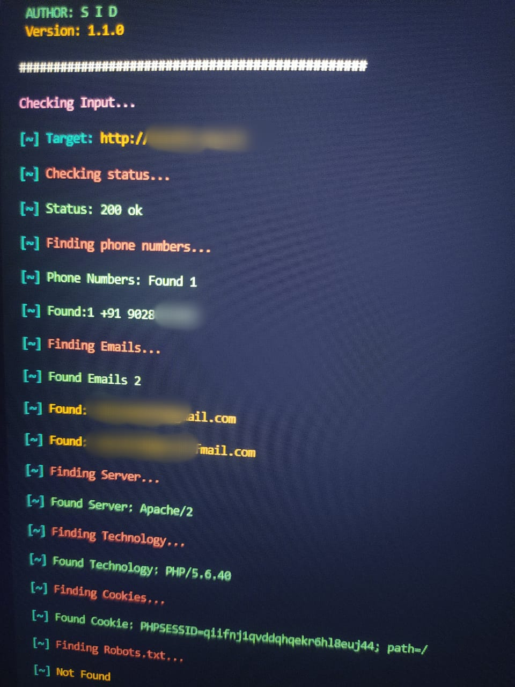

<h1>Web scraping Tool</h1>

 
<h2>Author: sid </h2>
 Version: <code>v1.1.0</code>

# Usgas: 
      $  git clone https://github.com/sid-hack3r/scrap.git
      $  pip3 install -r requirements.txt
      $  chmod +x scrap.py 
      $ python3 scrap.py https://example.com

# This tool finding
<ul>
<li>Gmails</li>
<li>Phone Numbers</li>
<li>Server</li> 
<li>Technology</li>
<li>Cookies</li>
<li>Robots.txt</li>
 <li>Directory finding</li>
</ul>
 

 Thank you !
